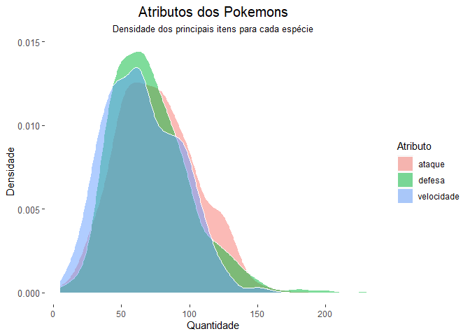

Trabalho final: Análise dos Pokemons
================

**1. Dicionário de dados**

    ## Rows: 949
    ## Columns: 20
    ## $ id              <dbl> 1, 2, 3, 4, 5, 6, 7, 8, 9, 10, 11, 12, 13, 14, 15, ...
    ## $ id_especie      <dbl> 1, 2, 3, 4, 5, 6, 7, 8, 9, 10, 11, 12, 13, 14, 15, ...
    ## $ id_geracao      <dbl> 1, 1, 1, 1, 1, 1, 1, 1, 1, 1, 1, 1, 1, 1, 1, 1, 1, ...
    ## $ pokemon         <chr> "bulbasaur", "ivysaur", "venusaur", "charmander", "...
    ## $ altura          <dbl> 0.7, 1.0, 2.0, 0.6, 1.1, 1.7, 0.5, 1.0, 1.6, 0.3, 0...
    ## $ peso            <dbl> 6.9, 13.0, 100.0, 8.5, 19.0, 90.5, 9.0, 22.5, 85.5,...
    ## $ exp_base        <dbl> 64, 142, 236, 62, 142, 240, 63, 142, 239, 39, 72, 1...
    ## $ tipo_1          <chr> "grama", "grama", "grama", "fogo", "fogo", "fogo", ...
    ## $ tipo_2          <chr> "venenoso", "venenoso", "venenoso", NA, NA, "voador...
    ## $ hp              <dbl> 45, 60, 80, 39, 58, 78, 44, 59, 79, 45, 50, 60, 40,...
    ## $ ataque          <dbl> 49, 62, 82, 52, 64, 84, 48, 63, 83, 30, 20, 45, 35,...
    ## $ defesa          <dbl> 49, 63, 83, 43, 58, 78, 65, 80, 100, 35, 55, 50, 30...
    ## $ ataque_especial <dbl> 65, 80, 100, 60, 80, 109, 50, 65, 85, 20, 25, 90, 2...
    ## $ defesa_especial <dbl> 65, 80, 100, 50, 65, 85, 64, 80, 105, 20, 25, 80, 2...
    ## $ velocidade      <dbl> 45, 60, 80, 65, 80, 100, 43, 58, 78, 45, 30, 70, 50...
    ## $ cor_1           <chr> "#78C850", "#78C850", "#78C850", "#F08030", "#F0803...
    ## $ cor_2           <chr> "#A040A0", "#A040A0", "#A040A0", NA, NA, "#A890F0",...
    ## $ cor_final       <chr> "#81A763", "#81A763", "#81A763", NA, NA, "#DE835E",...
    ## $ url_imagem      <chr> "https://raw.githubusercontent.com/phalt/pokeapi/ma...
    ## $ url_icone       <chr> "//cdn.bulbagarden.net/upload/e/ec/001MS.png", "//c...

**2. Ajuste da base**

A primeira ação será retirar da base os Pokemons que não contém geração.
Isso, pois, essa lista se refere a casos especiais de Pokemons
(personagens que apareceram em algum episódio, que fazem parte de algum
mapa específico, que não tem algum tipo de poder e etc.). Dessa forma,
para evitar qualquer viés ou problema com a análise, decidi retirar da
base.

**3. Iniciando as análises**

A jornada Pokemon da Curso-R com dados se iniciará com um objetivo
principal: encontrar os personagens com melhores atributos, tendo como
referência os tipos e seus principais nomes. Dessa forma, a análise se
estruturou da seguinte maneira: primeiramente, buscando a distribuição
dos pokemons, por tipo e por atributo; após isso, observar como cada
agrupamento apresenta seus desempenhos; e, por fim, capturando os
principais nomes das respectivas relações. Sendo assim, completando o
objetivo da jornad, pois, como todo desafio trata de encarar diversos
estádios e cidades, cada um com sua especialidade, buscaremos explorar
os melhores pokemons de acordo com suas variedades.

**4. Distribuição da quantidade de pokemons por tipo**

