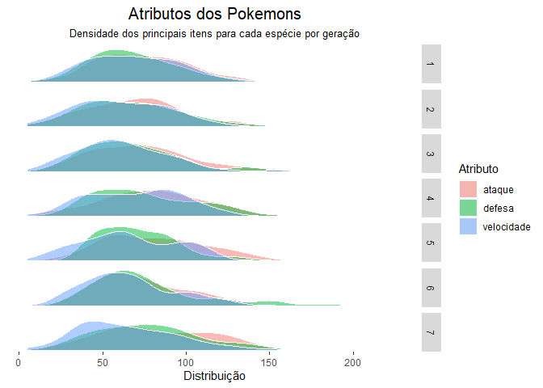
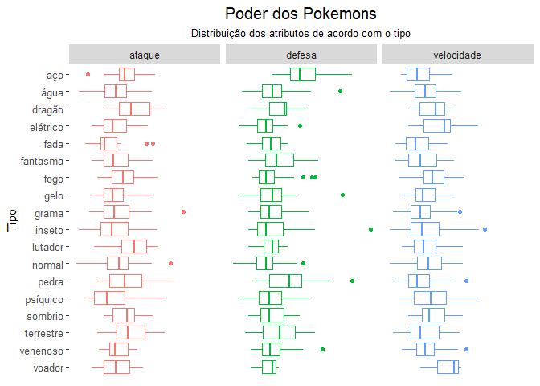
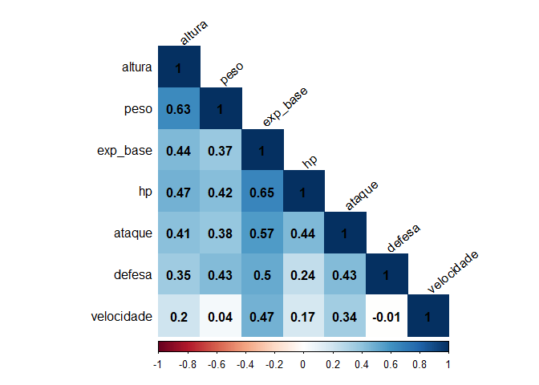
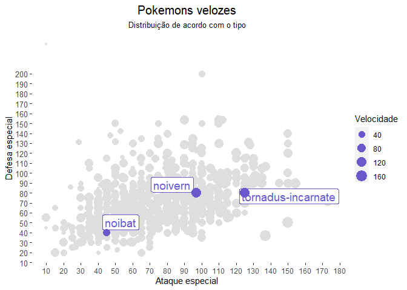
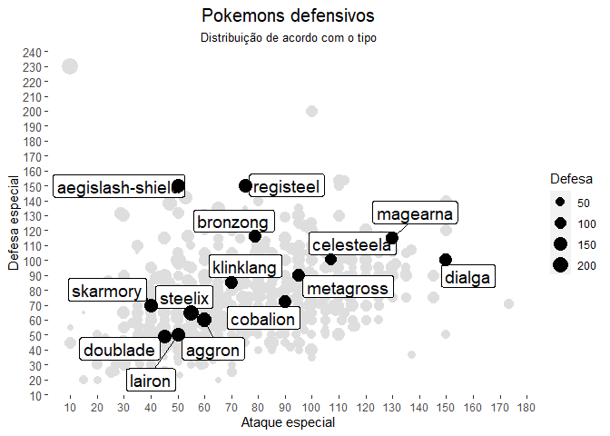
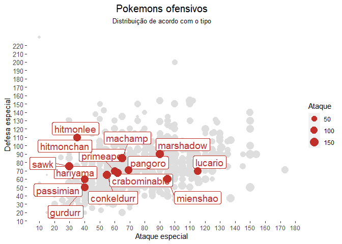
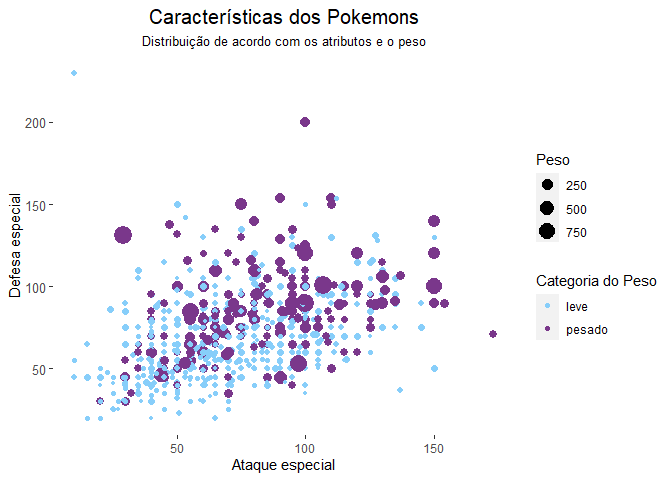
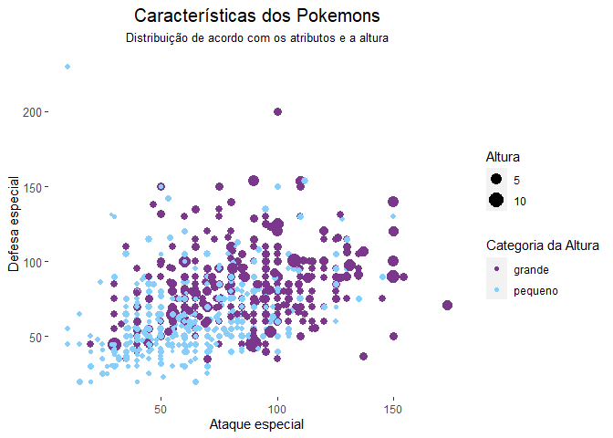
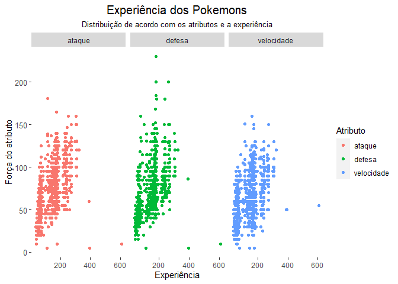

Trabalho final: Análise dos Pokemons
================

**1. Dicionário de dados**

Para entender os dados mais específicos, é importante verificar a
situação da base. Dessa forma, cabe pontuar alguns detalhes da base.

<ul>

<li>

pokemon = nome dos pokemon

</li>

<li>

exp\_base = experiência inicial do pokemon

</li>

<li>

hp = saúde/vida do pokemon

</li>

<li>

tipo = categoria do pokemon

</li>

</ul>

Outras variáveis estão diretamente relacionadas aos atributos dos
pokemons. Tanto para a força de atributos (como ataque, defesa, poderes
especiais), quanto das características dos respectivos pokemons (cor,
altura, peso e etc.).

    ## Rows: 949
    ## Columns: 20
    ## $ id              <dbl> 1, 2, 3, 4, 5, 6, 7, 8, 9, 10, 11, 12, 13, 14, 15, ...
    ## $ id_especie      <dbl> 1, 2, 3, 4, 5, 6, 7, 8, 9, 10, 11, 12, 13, 14, 15, ...
    ## $ id_geracao      <dbl> 1, 1, 1, 1, 1, 1, 1, 1, 1, 1, 1, 1, 1, 1, 1, 1, 1, ...
    ## $ pokemon         <chr> "bulbasaur", "ivysaur", "venusaur", "charmander", "...
    ## $ altura          <dbl> 0.7, 1.0, 2.0, 0.6, 1.1, 1.7, 0.5, 1.0, 1.6, 0.3, 0...
    ## $ peso            <dbl> 6.9, 13.0, 100.0, 8.5, 19.0, 90.5, 9.0, 22.5, 85.5,...
    ## $ exp_base        <dbl> 64, 142, 236, 62, 142, 240, 63, 142, 239, 39, 72, 1...
    ## $ tipo_1          <chr> "grama", "grama", "grama", "fogo", "fogo", "fogo", ...
    ## $ tipo_2          <chr> "venenoso", "venenoso", "venenoso", NA, NA, "voador...
    ## $ hp              <dbl> 45, 60, 80, 39, 58, 78, 44, 59, 79, 45, 50, 60, 40,...
    ## $ ataque          <dbl> 49, 62, 82, 52, 64, 84, 48, 63, 83, 30, 20, 45, 35,...
    ## $ defesa          <dbl> 49, 63, 83, 43, 58, 78, 65, 80, 100, 35, 55, 50, 30...
    ## $ ataque_especial <dbl> 65, 80, 100, 60, 80, 109, 50, 65, 85, 20, 25, 90, 2...
    ## $ defesa_especial <dbl> 65, 80, 100, 50, 65, 85, 64, 80, 105, 20, 25, 80, 2...
    ## $ velocidade      <dbl> 45, 60, 80, 65, 80, 100, 43, 58, 78, 45, 30, 70, 50...
    ## $ cor_1           <chr> "#78C850", "#78C850", "#78C850", "#F08030", "#F0803...
    ## $ cor_2           <chr> "#A040A0", "#A040A0", "#A040A0", NA, NA, "#A890F0",...
    ## $ cor_final       <chr> "#81A763", "#81A763", "#81A763", NA, NA, "#DE835E",...
    ## $ url_imagem      <chr> "https://raw.githubusercontent.com/phalt/pokeapi/ma...
    ## $ url_icone       <chr> "//cdn.bulbagarden.net/upload/e/ec/001MS.png", "//c...

**2. Ajustes da base**

A primeira ação será retirar da base os Pokemons que não contém geração.
Isso, pois, essa lista se refere a casos especiais de Pokemons
(personagens que apareceram em algum episódio, que fazem parte de algum
mapa específico, que não tem algum tipo de poder e etc.). Dessa forma,
para evitar qualquer viés ou problema com a análise, decidi retirar da
base.

Outra referência importante para entender a análise é que os tipos
escolhidos são todos relacioandos ao tipo\_1. Isso, pois, considero que
essa é a principal categoria do Pokemon. De modo que o tipo\_2, que é
utilizado apenas em uma parte da análise, é uma referência extra, de
maior detalhamento. Por isso, o tipo\_1 será tratado como categoria
principal.

**3. Iniciando as análises**

A jornada Pokemon da Curso-R com dados se iniciará com um objetivo
principal: encontrar os personagens com orientação baseada nos dados.
Sendo assim, buscando os melhores atributos, tendo como referência os
tipos e seus principais nomes. Dessa forma, a análise se estruturou da
seguinte maneira: primeiramente, buscando a distribuição dos pokemons,
por tipo e por atributo; após isso, observar como cada agrupamento
apresenta seus desempenhos; e, por fim, capturando os principais nomes
das respectivas relações. Sendo assim, completando o objetivo da jornad,
pois, como todo desafio trata de encarar diversos estádios e cidades,
cada um com sua especialidade, buscaremos explorar os melhores pokemons
de acordo com suas variedades.

**4. Distribuição da quantidade de pokemons por tipo**

Essa separação serve para demonstrar como há uma certa concentração para
algumas categorias. A distribuição por gerações permite entender se
houve alguma variação ao longo da história Pokemon. Entretanto, é
possível perceber que, dentre as **18 categorias**, há uma prevalência
de características específicas. No caso, destaco: **água**, **grama** e
**inseto**. Além dessas, também há uma forte presença de pokemons do
tipo **normal**, que trata de uma forma mais genérica de pokemons
(envolvendo roedores, aves e etc.)

A tabela permite observar, de forma descritiva, o comportamento citado
acima. Uma presença forte de determinados tipos e, por outro lado,
alguns tipos acabam ficando com pouca presença de pokemons.

| categoria |  1 |  2 |  3 |  4 |  5 |  6 |  7 |
| :-------- | -: | -: | -: | -: | -: | -: | -: |
| aço       | NA |  2 |  9 |  3 |  4 |  4 |  2 |
| água      | 28 | 18 | 24 | 13 | 17 |  5 |  9 |
| dragão    |  3 | NA |  7 |  3 |  7 |  4 |  3 |
| elétrico  |  9 |  6 |  4 |  7 |  7 |  3 |  3 |
| fada      |  2 |  5 | NA |  1 | NA |  9 |  1 |
| fantasma  |  3 |  1 |  4 |  6 |  5 |  4 |  4 |
| fogo      | 12 |  8 |  6 |  5 |  8 |  8 |  5 |
| gelo      |  2 |  4 |  6 |  3 |  6 |  2 | NA |
| grama     | 12 |  9 | 12 | 13 | 15 |  5 | 12 |
| inseto    | 12 | 10 | 12 |  8 | 18 |  3 |  9 |
| lutador   |  7 |  2 |  4 |  2 |  7 |  3 |  4 |
| normal    | 22 | 15 | 18 | 17 | 17 |  4 | 12 |
| pedra     |  9 |  4 |  8 |  6 |  6 |  8 |  4 |
| psíquico  |  8 |  7 |  8 |  7 | 14 |  3 |  6 |
| sombrio   | NA |  5 |  4 |  3 | 13 |  3 |  1 |
| terrestre |  8 |  3 |  6 |  4 |  9 | NA |  2 |
| venenoso  | 14 |  1 |  3 |  6 |  2 |  2 |  4 |
| voador    | NA | NA | NA | NA |  1 |  2 | NA |

Tabela 1. Distribuição dos pokemons por tipo ao longo das gerações

**5. Densidade dos principais atributos Pokemon**

Observar a densidade dos atributos de força dos pokemons ajuda a
entender se há alguma variação para esses itens ao longo das gerações.
Aqui, há uma percepção importante. A valorização para determinado
atributo é pequena ao longo das gerações, isso é importante para
entender que os Pokemons seguem em mesmo nível ao longo das temporadas.
Dessa maneira, não será necessário realizar nenhum recorte para comparar
toda a base de pokemons.

**6. Alcance dos tipos de Pokemon para cada atributo**

Dessa maneira, para tentar compreender quais são os tipos mais potentes
para cada atributo, é possível observar a distribuição dos respectivos
pokemons em relação ao seu desempenho em ataque, defesa e velocidade.
Para seguir analisando tais características, utilizarei os tipos com
maior média em cada atributo entre todos observados. Sendo assim: o tipo
**lutador** para encontrar pokemons de **ataque**; para o atributo de
**defesa**, pokemons do tipo **aço**; e, por fim, o **voador** para
**velocidade**.

**7. Há alguma correlação entre as variáveis de força?**

Uma forma interessante para observar se existe alguma variável que
influencia em outra é testando a correlação entre os pares. Dessa forma,
desenvolver a matriz é importante para definir quais variáveis serão
levadas adiante na verificação mais ampla de cada atributo. Entretanto,
como pode-se observar, não há relação forte entre as referências de
poder (ataque, defesa e velocidade).

A variável que aponta maios correlação é sempre a de Experiência.
Entretanto, isso já era esperado, já que quanto mais experiência de
base, representa que o Pokemon é mais evoluído. Isso, sem dúvidas, é uma
influência para que os atributos cresçam. Porém, não seria interessante
inserir tal dado para buscar o Pokemon.

**8. Investigando os atributos**

Como não houve nenhuma referência de correlação significativa no item 7,
a sequência da investigação se deu para os ataques especiais. A análise
ficou focada na distribuição de todos os pokemons, com enfoque nas
referências citadas no item 6.

**8.1. Atributo velocidade**

Neste caso, o tipo **voador** foi utilizado para a definição dos
pokemons de **velocidade**. Este é um caso específico, pois existem
somente três pokemons do tipo principal voador. As referências são:
**Noibat**, **Noivern** e **Tornadus-Incarnate**. O último consegue ser
o mais potente deles, tendo maior alcance de poderes especiais.

**8.2. Atributo defesa**

Neste caso, para a **defesa**, a escolha foi o tipo **aço**. Para esses,
há uma porção de Pokemons disponíveis para escolha. As principais
referências são: **Dialga**, pokemon com alta força de ataque especial
e **Aegislash-Shield**, com forte potência para defesa especial. Todos
eles, com um poder defensivo maior que 100.

**8.3. Atributo ataque**

Para o **ataque**, os pokemons de tipo **lutador** são os escolhidos.
Assim como os defensivos, o número de Pokemons disponíveis é grande. As
principais referências são: **Lucario**, pokemon com alta força de
ataque especial e **Hitmonchan**, com grande potência para defesa
especial. Todos esses também contam com um poder ofensivo maior que 100.

**9. Observações adicionais**

A fim de dar extensão para as análises, cabe investigar algumas
pontuações gerais sobre os Pokemons. Para isso, cabe responder mais
algumas questões

**Há relação entre o rating dos Pokemons e sua estrutura física?**

A primeira referência em relação aos atributos de ataque e defesa não
apontam pra uma interferência das características físicas. Pokemons
**grandes** e **pesados** não aparecem em um bloco privilegiado de
atributos. Esses itens não garante acréscimo de poderes para os mesmos.

**Há relação entre a experiência e os atributos do Pokemon?**

Como dito no início da análise, a referência de experiência parece
influenciar as bases dos atributos de poder e força. No caso, pode-se
perceber que, mesmo que levemente, quanto mais experiência de base, mais
forte o Pokemon será em seu respectivo atributo.

**10. Observações finais**

Com essas observações, encerro a análise sobre a base dos Pokemons. Foi
possível, aqui, realizar uma escolha orientada de cada um dos tipos e
espécies, definindo os melhores atributos dentro das suas
possibilidades. Da mesma maneira, também foi possível perceber algumas
influências que podem afetar o poder dos Pokemons - seja por geração,
por experiência ou por característica física. Sendo assim, mesmo que de
forma introdutória, conseguimos iniciar uma jornada Pokemon orientada a
dados.
